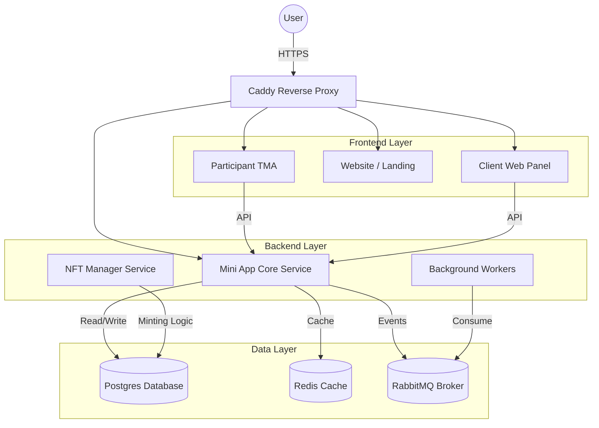
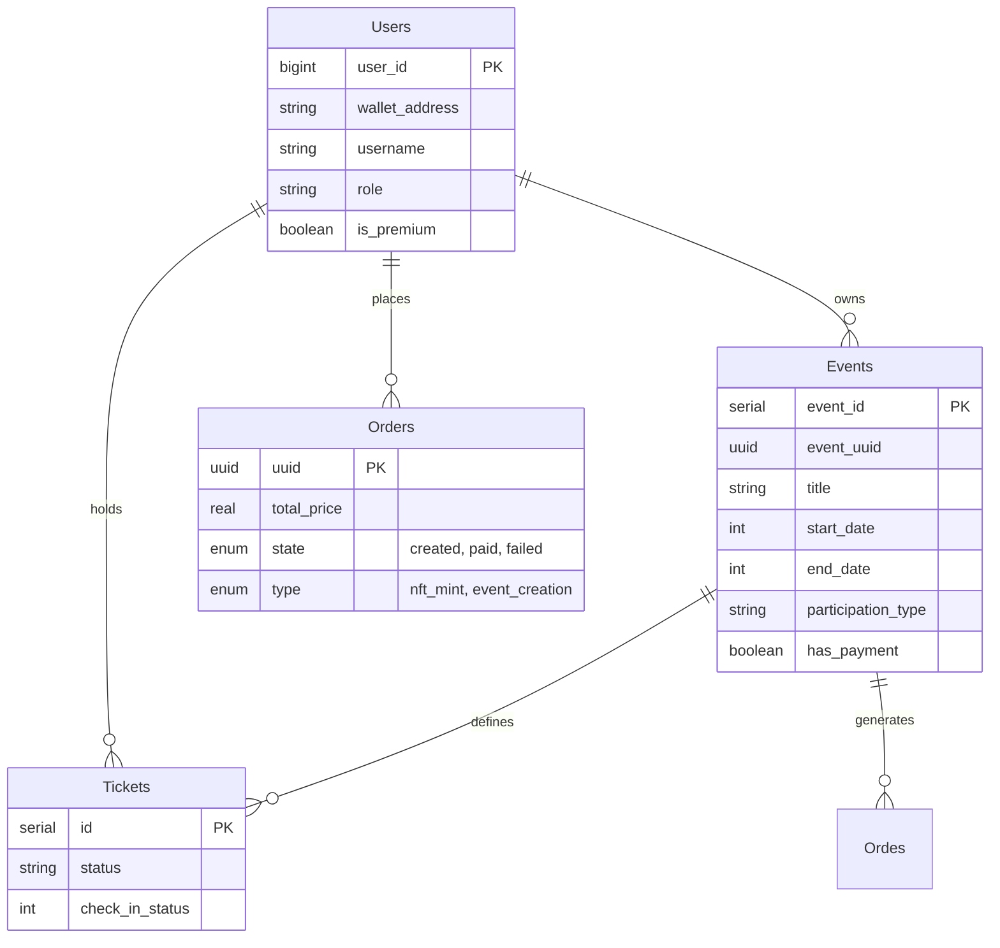
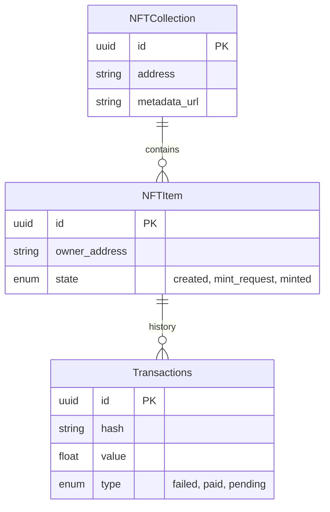

# Ontonbot Architecture and Design Documentation

## 1. System Overview
Ontonbot is a modular event management and engagement platform designed for the TON blockchain ecosystem. It operates as a monorepo containing multiple frontend applications and backend services, orchestrated via Docker.

### High-Level Architecture
The system follows a microservices-like pattern where distinct domains (Core Logic, NFT Management, Frontend) are separated into different containers/services, communicating via APIs and a message broker (RabbitMQ).

## 2. Service Descriptions

| Service | Technology | Role |
| :--- | :--- | :--- |
| **Mini App** | Node.js / Drizzle | **Core Backend**. Handles user auth, event management, orders, and business logic. Exposes the primary REST/Socket API. |
| **Participant TMA** | Next.js / React | **Primary Frontend**. The Telegram Mini App interface for end-users to discover events and buy tickets. |
| **NFT Manager** | Node.js / Prisma | **Specialized Backend**. Handles TON blockchain interactions, NFT minting, and collection management. |
| **Website** | Next.js | Public-facing landing page (`onton.live`). |
| **Client Web** | Next.js | Dashboard for Event Organizers to manage their events and view analytics. |
| **RabbitMQ** | RabbitMQ | Message broker for async tasks (emails, blockchain indexing, notifications). |
| **Postgres** | PostgreSQL 16 | Primary relational database. Stores two main logical databases: `mini-app` and `nft-manager`. |

## 3. Database Design

The system uses a **Split-Database Pattern** hosted on a single Postgres instance:
1.  **Core DB (`mini-app`)**: Managed via **Drizzle ORM**. Stores users, events, orders.
2.  **NFT DB (`nft-manager`)**: Managed via **Prisma ORM**. Stores minting transaction states.

### Core Domain Model (Drizzle)
*Note: Simplified view of key relationships.*

### NFT Domain Model (Prisma)
Handles the state of blockchain assets.

## 4. Key Business Logic Flows

### Event Creation
1.  **Organizer** (User) connects wallet via `Client Web Panel`.
2.  Submits event details (Title, Date, Capacity).
3.  **Mini App** validates data and creates `events` record.
4.  If it's an NFT-ticketed event, a request is sent to **NFT Manager** to deploy a collection.

### Ticket Purchase
1.  **Participant** (User) selects a ticket in `Participant TMA`.
2.  **Mini App** creates an `orders` record with `state: created`.
3.  **Payment Processing**:
    *   User sends TON to the platform wallet.
    *   **Worker** detects the transaction (via `WatchWallet` in NFT DB).
    *   **Mini App** updates order `state: paid`.
4.  **Fulfillment**:
    *   Ticket is issued in `tickets` table.
    *   Notification sent via **Telegram Bot**.

### Background Workers
Heavy lifting is offloaded to queues to ensure UI responsiveness.
-   **Reward Worker**: Distributes points/tokens after event completion.
-   **Notification Worker**: Sends Telegram messages for reminders.
-   **Moderation Bot**: Checks user generated content.
